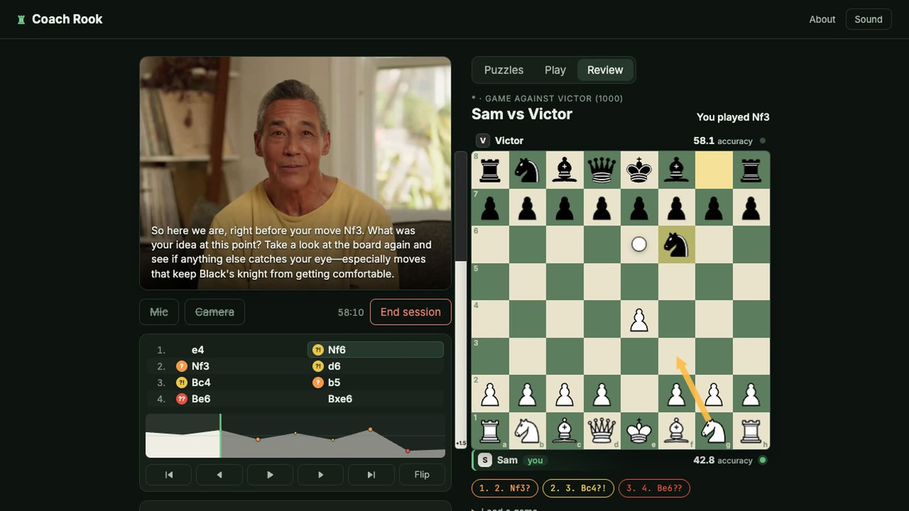

# Coach Rook

A live video chess coach built on [Tavus](https://www.tavus.io) CVI. You work on a real board while a coach on video watches every move, talks it through with you, and points at the squares it means. Ask to play, to review a game, or to go back to puzzles, and the coach takes you there.

[](https://coach-rook.onrender.com/about)

## Watch

Both videos are on the [About page](https://coach-rook.onrender.com/about).

- [The ad](https://coach-rook.onrender.com/ad.mp4), 50 seconds. The four coaches, recorded from live calls.
- [A real call](https://coach-rook.onrender.com/live-call.mp4), two minutes, uncut. A puzzle, then the student asks for a game, a review of it, the move where it went wrong, and to go back to puzzles. The coach's replies are live and unscripted. The student's requests were typed, not spoken.

## Try it

https://coach-rook.onrender.com

The board, puzzles, games and review work for anyone. The video coach needs an access code. The site is on a free host, so the first load can take about 30 seconds.

In a session, try saying:

1. "Let's play. You at a thousand."
2. A few moves in: "Can we review the game we just played?"
3. "Show me where it went wrong."
4. "Back to puzzles."

## What it does

- **Puzzles.** About 4,800 tactics from the Lichess database in 20 themes. Hints go from a question, to a highlighted piece, to the pattern's name, to the answer only if you ask.
- **Play.** A game against the coach at one of six strengths, 500 to 3000. The coach talks more at the low end and less at the top.
- **Review.** A game you just played, a saved one, a PGN, a Lichess link or a chess.com username. The board goes back to each costly move and you try again.
- **Four coaches.** Anna, Victor, Helen and Darius: each has a face, a voice and a way of coaching.
- **Memory.** The coach opens each session knowing what you solved, what you missed and how your games went.

## How it works

- **The model never does chess.** The board validates every move and Stockfish judges it. The coach is told the position and the verdict in plain English.
- **The coach acts through eleven tools**: analyze a move, point at squares, load a puzzle, start a game, take back a move, open a review, jump to a move. The browser carries them out and reports back.
- **The board talks to the coach** over the Tavus interaction protocol. Most updates are silent context; the coach is asked to speak only when there is something to say.
- **Memory is the app's own record.** Every session is kept in Postgres. The notes the coach reads are rebuilt from that record and checked after every write. See [docs/MEMORY.md](docs/MEMORY.md).
- **Everything is logged**: every request, Tavus call, tool call, utterance and game. See [docs/OBSERVABILITY.md](docs/OBSERVABILITY.md).
- **The language model was chosen by test.** In live calls with the same four requests, Tavus's default model made one of the four tool calls. `tavus-gpt-4.1` made all four, on each of the four coaches.

From Tavus it uses CVI, one PAL per coach, tools delivered as app messages, the interaction protocol, memory stores and conversation webhooks.

## Run it

Needs Node 20 or later.

```
npm install
cp .env.example .env        # add TAVUS_API_KEY
npm start                   # http://localhost:3000
npm test                    # 90 tests; Tavus is faked, so no key or minutes are needed
```

Without `TAVUS_API_KEY` everything except the video coach still works. On first boot the server registers the tools and the four PALs itself. Set `DATABASE_URL` to keep sessions, memory and logs across restarts, and `ACCESS_CODE` to control who can start a video session. The full list is in [docs/REFERENCE.md](docs/REFERENCE.md#configuration).

## Known limits

- The strength ratings name engine settings. They have not been measured against rated players.
- A session ends after an hour, which is Tavus's limit.
- One access code is shared by everyone. A student is identified by a name and a key kept in their browser, not an account.
- Calls are logged as transcripts and board activity. Audio and video are not recorded.
- There are no browser tests. `scripts/call-test.mjs` drives a real call with typed requests and checks the coach acted on each; all four coaches pass it. Speech recognition is outside that test.

## More

- [docs/REFERENCE.md](docs/REFERENCE.md): configuration, architecture, the tools, each mode, the HTTP API, design decisions, file map.
- [docs/MEMORY.md](docs/MEMORY.md): how memory works and what is guaranteed.
- [docs/OBSERVABILITY.md](docs/OBSERVABILITY.md): every input and output, and where it is recorded.

Puzzles come from the [Lichess puzzle database](https://database.lichess.org/#puzzles) (CC0). The engine is [Stockfish](https://stockfishchess.org). The code is MIT licensed.
